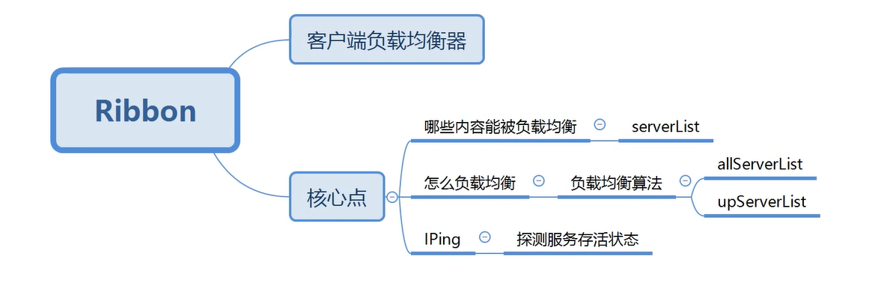
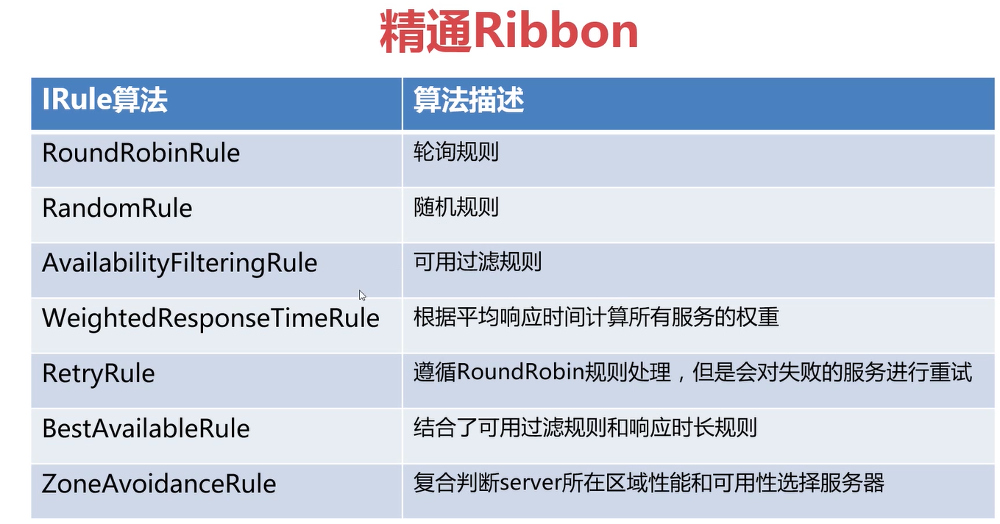
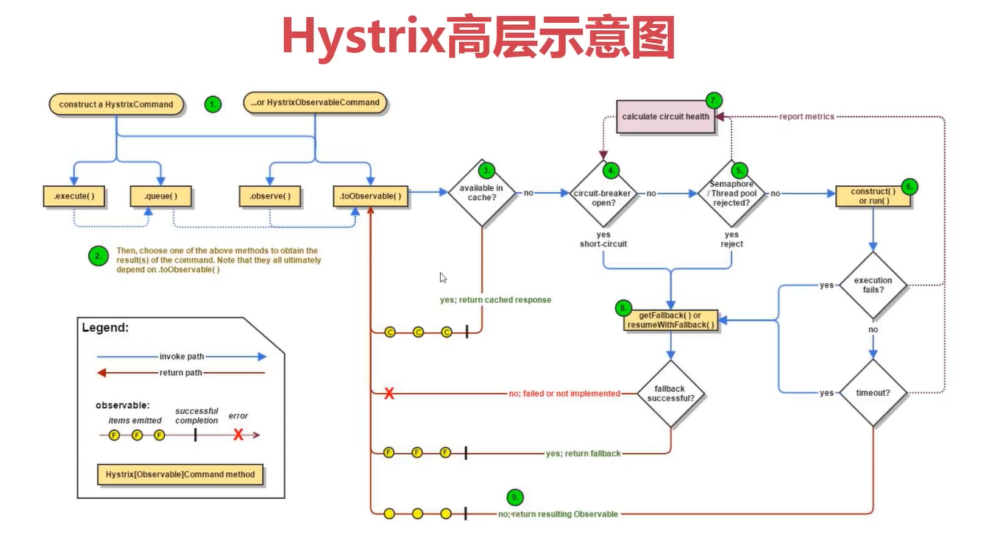
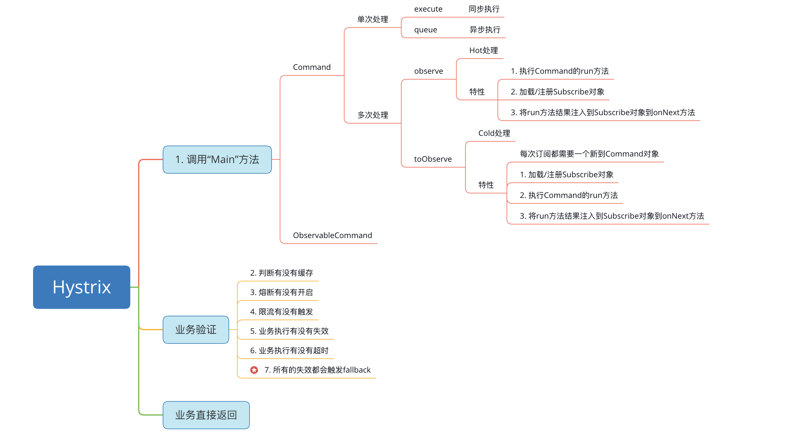

## 深度解锁Spring Cloud主流组件课程项目

### 初识微服务
#### 微服务等"自我介绍"
   * 微服务主要有两个关键词：微和服务
   * 服务：实现某种业务逻辑等模块或应用
   * 微：望文生义，就是小的意思

#### 微服务的演进
 一体化应用 -->  SOA  -->  微服务
 
 #### 演进史的"启发"
   * 微服务和SOA思想是想通的
   * 微服务相较于SOA更轻量，耦合更低
   * 微服务减少了大量ESB的开发和维护工作
 
#### 微服务优点
   * 服务组件化和去中心化
   * 分散服务治理和分散数据管理
   * 强调业务单一性，弱化业务耦合度
   * 容错设计和资源合理分配

#### 微服务缺点
   * 对人员技能素质要求较高
   * 过多的约定俗成对团队协调性要求较高
   * 微服务拆分粒度决定了扩展难度和维护难度
   * 回归冒烟等测试可以用灾难来形容

#### 微服务等基本术语
   * 服务提供者：业务实现者，封装业务接口同时提供业务实现逻辑
   * 服务消费者：业务调用者，调用服务提供者对外暴露的接口
   * 负载均衡：同一个服务的多个服务提供者分摊请求处理
   * 注册中心：提供公共的地方让服务提供者和消费者相互发现
   * 服务治理：服务拆分以后各种问题和解决方案的集合

### SpringCloud 注册中心

 #### Eureka 介绍
  ##### Eureka是什么？
   * Eureka是SpringCloud Netflix的核心子模块
   * Eureka包含：Eureka Server和Eureka Client
   * Server提供服务注册服务，存储所有可用服务节点
   * Client用于简化与Server通讯复杂度
 #### Eureka 核心特性
  ##### 服务注册
   * Eureka Client在第一次心跳时向Eureka Server注册
   * 注册时会提供诸多自身元数据：主机名、端口、健康指标URL等
  
  ##### 服务续约
   * Eureka Client通过发送心跳进行续约
   * 默认情况下每30s发送一次心跳
   * 如90s内Eureka Server未收到续约，则进行服务剔除
   
  ##### 服务下线
   * Eureka Client优雅退出时会发送cancel命令
   * Eureka Server收到cancel命令时，会删除该节点
   
  ##### 获取注册列表信息
   * Eureka Client会缓存由Server获取等注册表信息
   * Eureka Client会定期更新注册表信息（默认30s）
   * Eureka Client会处理注册表等合并等内容
 
 #### ***Eureka 面试点*** ####
   
  ##### 多注册中心比较
   * 分布式基础：CAP理论
        * CAP理论 ： 
            * 一致性：Consistency，一般分为强一致性和弱一致性
            * 可用性：Availability
            * 分区容错性：Partition tolerance
   * 常见注册中心：Zookeeper、Eureka等
   * Eureka主要保证AP特性
   * Zookeeper是典型的CP特性
   
  ##### Eureka注册慢
   * 注册慢的根本原因在于Eureka的AP特性
   * Eureka Client延迟注册，默认30s
   * Eureka Server的响应缓存，默认30s
   * Eureka Server的缓存刷新，默认30s
   
  ##### Eureka的自我保护
   * Eureka Server会自动更新续约更新阈值
   * Eureka Server续约更新频率低于阈值则进入保护模式
   * 自我保护模式下Eureka Server不会剔除任何注册信息
   
 ### Spring Cloud Ribbon 负载均衡器
 
  #### 精通 Ribbon
   ##### Ribbon概述
   * Ribbon是客户端负载均衡器
   * Ribbon核心功能：服务发现
   * Ribbon核心功能：服务选择规则
   * Ribbon核心功能：服务监听 
  
  #### Ribbon 架构
  
  
   #### Ribbon 与 Eureka整合
   * Ribbon 天然与 Eureka无缝整合
   * 通过 @LoadBalanced 注解提供负载均衡支持
   * 通过 ribbon.eureka.enabled=false禁用Eureka
   
   #### Ribbon 核心之 IRule
   * IRule 通过特定算法选取要访问的服务
   * IRule 常使用 BestAvailableRule 和 WeightedResponseTimeRule
   
   #### Ribbon 常用算法
   
   
   #### Ribbon 核心之 IPing
   * IPing 是 Ribbon 保证服务可用的基石
   * 常见实现：NIWSDiscoveryPing、PingUrl等
   
   #### Ribbon IPing 算法
   * NIWSDiscoveryPing：不执行Ping操作，根据Eureka Client的反馈判断存活
   * PingUrl：使用HttpClient对服务进行Ping操作
   * DummyPing："人性本善"流算法， 默认返回true
   * NoOpPing：永远返回true
  
   #### Ribbon 参数配置
   * 默认参数配置：DefaultClientConfigImpl
   * Ribbon Key 定义：CommonClientConfigKey
   * Ribbon 参数分为全局配置和指定客户端配置
   * 参数格式：```<client>.ribbon.<key>=<value>```
    
   #### Ribbon 核心之 ServerList
   * ServerList是Ribbon存储的可用服务列表
   * ServerList可用手动设置
   * ServerList常见应用是从Eureka中自动获取
  
### Spring Cloud Hystrix 熔断器
 
  #### Hystrix介绍
  * Hystrix是用于处理延迟和容错的开源库
  * Hystrix主要用于避免级联故障，提供系统弹性
  * Hystrix解决了由于扇出导致的"雪崩效应"
  * Hystrix的核心是"隔离术"和"熔断机制"
  
  #### Hystrix主要作用
  * 服务隔离和服务熔断
  * 服务降级、限流和快速失败
  * 请求合并和请求缓存
  * 自带单体和集群监控
  
  #### Hystrix高层示意图
  
    
  #### Hystrix业务流程图
  
  
  #### Hystrix两种命令模式
  * HystrixCommand和HystrixObservableCommand
  * Command会以隔离的形式完成run方法调用
  * ObservableCommand使用当前线程进行调用
  
  #### Hystrix配置之GroupKey
   * Hystrix中GroupKey是唯一必填项
   * GroupKey可以作为分组监控和报警的作用
   * GroupKey将作为线程池的默认名称
   
  #### Hystrix配置之GroupKey
   * Hystrix可以不填写CommandKey
   * 默认Hystrix会通过反射类名命名CommandKey
   * 在Setting中加入andCommandKey进行命名
 
  #### Hystrix请求特性
   * Hystrix支持将请求结果进行本地缓存
   * 通过实现getCacheKey方法来判断是否取出缓存
   * 请求缓存要求请求必须在同一个上下文
   * 可以通过RequestCacheEnabled开启请求缓存
   
  #### Hystrix请求合并
   * Hystrix支持将多个请求合并成一次请求
   * Hystrix请求合并要求两次请求必须足够"近"
   * 请求合并分为局部合并和全局合并两种
   * Collapse可以设置相关参数
   
  
  