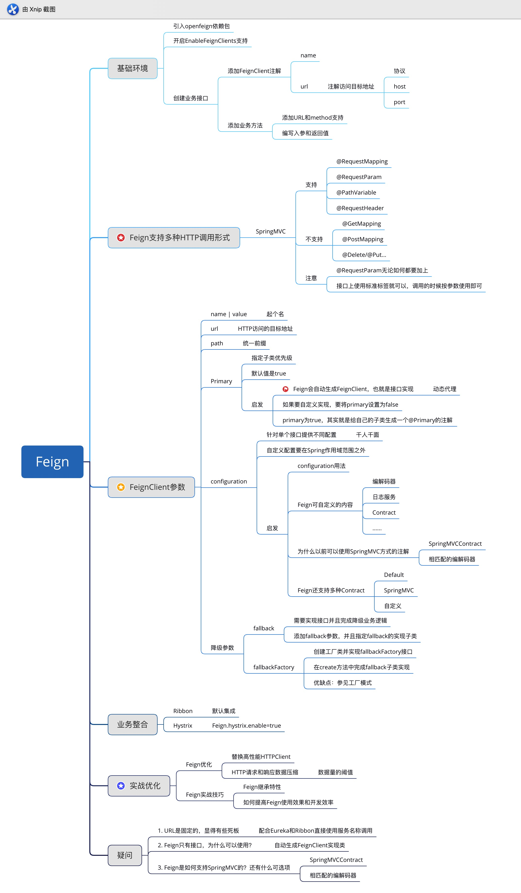

## 深度解锁Spring Cloud主流组件课程项目

### 初识微服务
#### 微服务等"自我介绍"
   * 微服务主要有两个关键词：微和服务
   * 服务：实现某种业务逻辑等模块或应用
   * 微：望文生义，就是小的意思

#### 微服务的演进
 一体化应用 -->  SOA  -->  微服务
 
 #### 演进史的"启发"
   * 微服务和SOA思想是想通的
   * 微服务相较于SOA更轻量，耦合更低
   * 微服务减少了大量ESB的开发和维护工作
 
#### 微服务优点
   * 服务组件化和去中心化
   * 分散服务治理和分散数据管理
   * 强调业务单一性，弱化业务耦合度
   * 容错设计和资源合理分配

#### 微服务缺点
   * 对人员技能素质要求较高
   * 过多的约定俗成对团队协调性要求较高
   * 微服务拆分粒度决定了扩展难度和维护难度
   * 回归冒烟等测试可以用灾难来形容

#### 微服务等基本术语
   * 服务提供者：业务实现者，封装业务接口同时提供业务实现逻辑
   * 服务消费者：业务调用者，调用服务提供者对外暴露的接口
   * 负载均衡：同一个服务的多个服务提供者分摊请求处理
   * 注册中心：提供公共的地方让服务提供者和消费者相互发现
   * 服务治理：服务拆分以后各种问题和解决方案的集合

### SpringCloud 注册中心

 #### Eureka 介绍
  ##### Eureka是什么？
   * Eureka是SpringCloud Netflix的核心子模块
   * Eureka包含：Eureka Server和Eureka Client
   * Server提供服务注册服务，存储所有可用服务节点
   * Client用于简化与Server通讯复杂度
 #### Eureka 核心特性
  ##### 服务注册
   * Eureka Client在第一次心跳时向Eureka Server注册
   * 注册时会提供诸多自身元数据：主机名、端口、健康指标URL等
  
  ##### 服务续约
   * Eureka Client通过发送心跳进行续约
   * 默认情况下每30s发送一次心跳
   * 如90s内Eureka Server未收到续约，则进行服务剔除
   
  ##### 服务下线
   * Eureka Client优雅退出时会发送cancel命令
   * Eureka Server收到cancel命令时，会删除该节点
   
  ##### 获取注册列表信息
   * Eureka Client会缓存由Server获取等注册表信息
   * Eureka Client会定期更新注册表信息（默认30s）
   * Eureka Client会处理注册表等合并等内容
 
 #### ***Eureka 面试点*** ####
   
  ##### 多注册中心比较
   * 分布式基础：CAP理论
        * CAP理论 ： 
            * 一致性：Consistency，一般分为强一致性和弱一致性
            * 可用性：Availability
            * 分区容错性：Partition tolerance
   * 常见注册中心：Zookeeper、Eureka等
   * Eureka主要保证AP特性
   * Zookeeper是典型的CP特性
   
  ##### Eureka注册慢
   * 注册慢的根本原因在于Eureka的AP特性
   * Eureka Client延迟注册，默认30s
   * Eureka Server的响应缓存，默认30s
   * Eureka Server的缓存刷新，默认30s
   
  ##### Eureka的自我保护
   * Eureka Server会自动更新续约更新阈值
   * Eureka Server续约更新频率低于阈值则进入保护模式
   * 自我保护模式下Eureka Server不会剔除任何注册信息
   
 ### Spring Cloud Ribbon 负载均衡器
 
  #### 精通 Ribbon
   ##### Ribbon概述
   * Ribbon是客户端负载均衡器
   * Ribbon核心功能：服务发现
   * Ribbon核心功能：服务选择规则
   * Ribbon核心功能：服务监听 
  
  #### Ribbon 架构
  
  
   #### Ribbon 与 Eureka整合
   * Ribbon 天然与 Eureka无缝整合
   * 通过 @LoadBalanced 注解提供负载均衡支持
   * 通过 ribbon.eureka.enabled=false禁用Eureka
   
   #### Ribbon 核心之 IRule
   * IRule 通过特定算法选取要访问的服务
   * IRule 常使用 BestAvailableRule 和 WeightedResponseTimeRule
   
   #### Ribbon 常用算法
   
   
   #### Ribbon 核心之 IPing
   * IPing 是 Ribbon 保证服务可用的基石
   * 常见实现：NIWSDiscoveryPing、PingUrl等
   
   #### Ribbon IPing 算法
   * NIWSDiscoveryPing：不执行Ping操作，根据Eureka Client的反馈判断存活
   * PingUrl：使用HttpClient对服务进行Ping操作
   * DummyPing："人性本善"流算法， 默认返回true
   * NoOpPing：永远返回true
  
   #### Ribbon 参数配置
   * 默认参数配置：DefaultClientConfigImpl
   * Ribbon Key 定义：CommonClientConfigKey
   * Ribbon 参数分为全局配置和指定客户端配置
   * 参数格式：```<client>.ribbon.<key>=<value>```
    
   #### Ribbon 核心之 ServerList
   * ServerList是Ribbon存储的可用服务列表
   * ServerList可用手动设置
   * ServerList常见应用是从Eureka中自动获取
  
### Spring Cloud Hystrix 熔断器
 
 #### Hystrix入门
  ##### Hystrix介绍
  * Hystrix是用于处理延迟和容错的开源库
  * Hystrix主要用于避免级联故障，提供系统弹性
  * Hystrix解决了由于扇出导致的"雪崩效应"
  * Hystrix的核心是"隔离术"和"熔断机制"
  
  ##### Hystrix主要作用
  * 服务隔离和服务熔断
  * 服务降级、限流和快速失败
  * 请求合并和请求缓存
  * 自带单体和集群监控
  
  ##### Hystrix高层示意图
  
    
 #### Hystrix特性
  ##### Hystrix业务流程图
  
  
  ##### Hystrix两种命令模式
  * HystrixCommand和HystrixObservableCommand
  * Command会以隔离的形式完成run方法调用
  * ObservableCommand使用当前线程进行调用
  
  ##### Hystrix配置之GroupKey
   * Hystrix中GroupKey是唯一必填项
   * GroupKey可以作为分组监控和报警的作用
   * GroupKey将作为线程池的默认名称
   
  ##### Hystrix配置之GroupKey
   * Hystrix可以不填写CommandKey
   * 默认Hystrix会通过反射类名命名CommandKey
   * 在Setting中加入andCommandKey进行命名
 
  ##### Hystrix请求特性
   * Hystrix支持将请求结果进行本地缓存
   * 通过实现getCacheKey方法来判断是否取出缓存
   * 请求缓存要求请求必须在同一个上下文
   * 可以通过RequestCacheEnabled开启请求缓存
   
  ##### Hystrix请求合并
   * Hystrix支持将多个请求合并成一次请求
   * Hystrix请求合并要求两次请求必须足够"近"
   * 请求合并分为局部合并和全局合并两种
   * Collapse可以设置相关参数
   
 #### Hystrix隔离术
  ##### Hystrix隔离之ThreadPoolKey
   * Hystrix可以不填写ThreadPoolKey
   * 默认Hystrix会使用GroupKey命名线程池
   * 在Setting中加入andThreadPoolKey进行命名
   
  ##### Hystrix隔离介绍
   * Hystrix提供了信号量和线程两种隔离手段
   * 线程隔离会在单独的线程中执行业务逻辑 
   * 信号量隔离在调用线程上执行
   * 官方优先推荐线程隔离
  
  ##### 线程隔离
   * 应用自身完全受保护，不会受其他依赖影响
   * 有效降低接入新服务的风险
   * 依赖服务出现问题，应用自身可以快速反应问题
   * 可以通过实时刷新动态属性减少依赖问题影响
   
  ##### 信号量隔离
   * 信号量隔离是轻量级的隔离术
   * 无网络开销的情况推荐使用信号量隔离
   * 信号量是通过计数器与请求线程比对进行限流的
   
 #### Hystrix降级机制
  ##### 降级介绍
   * 降级是一种"无奈"的选择，就是俗称的备胎
   * Command降级需要实现fallback方法
   * ObservableCommand降级实现resumeWithFallback方法
    
  ##### 降级触发规则
   * HystrixBadRequestException以外的异常
   * 运行超时或熔断器处于开启状态
   * 线程池或信号量已满
   
  ##### 快速失败
   * Hystrix提供了快速失败的机制
   * 当不实现fallback方法时会将异常直接抛出
  
 #### Hystrix熔断机制
  ##### 熔断器介绍
   * 熔断器是一种开关，用来控制流量是否执行业务逻辑
   * 熔断器核心指标：快照时间窗
   * 熔断器核心指标：请求总数阈值
   * 熔断器核心指标：错误百分比阈值
   
  ##### 熔断器状态
   * 熔断器开启：所有请求都会进入fallback方法
   * 熔断器半开启：间歇性让请求触发run方法
   * 熔断器关闭中：正常处理业务请求
   * 默认情况下熔断器开启5s后进入半开启状态
   
### Spring Cloud Feign 
 
 #### Feign 入门
  ##### Feign 介绍
   * Feign是一个非常好用的HTTP客户端
   * Feign很大程度上简化了HTTP调用方式
   * Feign很好的弥补了Spring Cloud的HTTP调用缺陷
   
  ##### Feign能干什么
   * Feign包含了多种HTTP的调用方式
   * Feign可以整合Ribbon和Hystrix
   * Feign提供了多种HTTP调用方式
   
  ##### Feign特性
   * Feign实现了可插拔注解支持，包括Feign和JAX-RS注解
   * Feign支持可插拔的HTTP编码器和解码器
   * Feign支持HTTP请求和响应的压缩
   
  ##### Feign使用步骤
   * 集成Feign环境
   * 添加FeignClient注解
   * 业务接口添加类似SpringMVC注解
   
 #### Feign 进阶
  ##### Feign 基础参数
   * name和value：给FeignClient指定名称
   * url：手动指定Http调用地址
   * Path：接口统一前缀
  
  ##### Feign 进阶参数
   * primary：多实现时指定优先级
   * configuration：自定义Feign配置
   * Fallback和FallbackFactory：降级统一处理
   
  ##### Feign 多组件集成
   * Feign可以集成Ribbon实现负载均衡
   * Feign可以集成Hystrix实现命令封装
   * Feign可以集成Hystrix实现业务降级
   
 #### Feign 面试点分析
 
  ##### Feign之HTTP性能优化
   * Feign默认使用的JDK自带的HTTP方式
   * Feign最大的优化点是更换HTTP底层实现
   * 目前Apache HTTPClient是一个非常好的选择
   
  ##### Feign之HTTP解压缩
   * HTTP常见优化项就是数据压缩
   * Feign可以支持GZip的请求解压缩
   * 注意：解压缩是把双刃剑，一定要谨慎使用
   
 #### Feign 实战技巧
  
  ##### Feign继承
   * 微服务的目标是大量复用，Feign会导致重复工作量
   * Feign提供了继承特性帮助我们解决这个问题
   * 接口复用最多只能有一层，切忌多继承
   
 #### Feign 思维导图
  
 
### Spring Cloud Zuul

 #### Zuul 自我介绍
  ##### 网关介绍
   * 由于微服务"各自为政的特性"使微服务的使用非常麻烦
   * 通常会有一个统一入口，成为网关
   * 网关主要是实现请求转发和请求过滤
   
  ##### Zuul 介绍
   * Zuul是网关大军中的一员，目前市场使用规律比较高
   * Zuul除了实现请求转发和过滤，一般还作为鉴权和容错使用
   * Zuul可以无缝衔接Ribbon和Hystrix
  
  ##### Zuul 使用
   * Zuul可以通过配置完成请求路由的配置
   * Zuul服务路由默认支持serviceId作为上下文
   * ignored-services可以禁用serviceId
   
  ##### 请求路由表达式
   * ? -> 匹配任意单个字符
   * \* -> 配置任意数量的字符
   * **  -> 配置任意数量的字符，支持多级目录
   
  ##### Zuul 高层架构图
  
   
  ##### Zuul 高层架构图
  
  
 #### Zuul 进阶
  ##### 自定义Filter
   * 继承ZuulFilter并实现相应的方法
   * 设置Filter类型、级别和是否启用
   * 开发具体的业务逻辑
   
  ##### 核心 PreFilter
   * ServletDetectionFilter：检测当前请求是否使用ZuulServlet来处理运行
   * FormBodyWrapperFilter：解析表单数据，并对下游请求进行重新编码
   * DebugFilter：该过滤器会根据配置参数zuul.debug.request和请求中的debug参数来决定是否执行过滤器中的操作
   * PreDecorationFilter：此过滤器根据提供的RouteLocator确定在哪里和如何路由
  
  ##### 核心 RoutingFilter
   * RibbonRoutingFilter：该过滤器只对请求上线中存在serviceId参数的请求进行处理，主要是面向服务路由的核心，它通过使用Ribbon和Hystrix来向服务实例发起请求，并将服务实例的请求结果返回
   * SimpleHostRoutingFilter：该过滤器只对URL配置的路由生效，主要是向routeHost参数的物理地址发起请求，该Filter直接使用httpClient完成调用，并没有返回Hystrix进行封装
   * SendForwardFilter：该过滤器只对请求上下文中存在的forward.do参数进行处理请求，主要用来处理路由规则中的forward本地跳转装配
  
  ##### 核心 PostFilter
   * SendErrorFilter：该过滤器主要利用上下文的错误信息来组成一个forward到API网关/error错误端点的请求来产生错误响应
   * SendResponseFilter：该过滤器主要利用上下文的响应信息来组织需要发送回客户端的响应内容
   
 #### Zuul 面试点
  
  ##### Zuul和Zuul2
   * Zuul使用的是阻塞式线程完成业务调用
   * Zuul2使用的是异步线程完成业务调用
   
